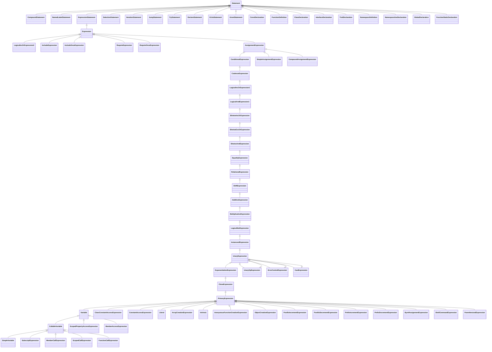

# AST

```mermaid
classDiagram
  Statement <|-- CompoundStatement
  Statement <|-- NamedLabelStatement
  Statement <|-- ExpressionStatement
  Statement <|-- SelectionStatement
  Statement <|-- IterationStatement
  Statement <|-- JumpStatement
  Statement <|-- TryStatement
  Statement <|-- DeclareStatement
  Statement <|-- EchoStatement
  Statement <|-- UnsetStatement
  Statement <|-- ConstDeclaration
  Statement <|-- FunctionDefinition
  Statement <|-- ClassDeclaration
  Statement <|-- InterfaceDeclaration
  Statement <|-- TraitDeclaration
  Statement <|-- NamespaceDefinition
  Statement <|-- NamespaceUseDeclaration
  Statement <|-- GlobalDeclaration
  Statement <|-- FunctionStaticDeclaration

  ExpressionStatement <|-- Expression
  Expression <|-- LogicalIncOrExpression2
  Expression <|-- IncludeExpression
  Expression <|-- IncludeOnceExpression
  Expression <|-- RequireExpression
  Expression <|-- RequireOnceExpression
  %% Spec-Fix so that AssignmentExpression is reachable
  Expression <|-- AssignmentExpression

  AssignmentExpression <|-- ConditionalExpression
  AssignmentExpression <|-- SimpleAssignmentExpression
  AssignmentExpression <|-- CompoundAssignmentExpression

  ConditionalExpression <|-- CoalesceExpression
  CoalesceExpression <|-- LogicalIncOrExpression1
  LogicalIncOrExpression1 <|-- LogicalAndExpression1
  LogicalAndExpression1 <|-- BitwiseIncOrExpression
  BitwiseIncOrExpression <|-- BitwiseExcOrExpression
  BitwiseExcOrExpression <|-- BitwiseAndExpression
  BitwiseAndExpression <|-- EqualityExpression
  EqualityExpression <|-- RelationalExpression
  RelationalExpression <|-- ShiftExpression
  ShiftExpression <|-- AdditiveExpression
  AdditiveExpression <|-- MultiplicativeExpression
  MultiplicativeExpression <|-- LogicalNotExpression
  LogicalNotExpression <|-- InstanceofExpression
  InstanceofExpression <|-- UnaryExpression

  UnaryExpression <|-- ExponentiationExpression
  UnaryExpression <|-- UnaryOpExpression
  UnaryOpExpression <|-- UnaryExpression
  UnaryExpression <|-- ErrorControlExpression
  ErrorControlExpression <|-- UnaryExpression
  UnaryExpression <|-- CastExpression
  CastExpression <|-- UnaryExpression

  ExponentiationExpression <|-- CloneExpression
  CloneExpression <|-- PrimaryExpression

  PrimaryExpression <|-- Variable
  PrimaryExpression <|-- ClassConstantAccessExpression
  PrimaryExpression <|-- ConstantAccessExpression
  PrimaryExpression <|-- Literal
  PrimaryExpression <|-- ArrayCreationExpression
  PrimaryExpression <|-- Intrinsic
  PrimaryExpression <|-- AnonymousFunctionCreationExpression
  PrimaryExpression <|-- ObjectCreationExpression
  PrimaryExpression <|-- PostfixIncrementExpression
  PrimaryExpression <|-- PostfixDecrementExpression
  PrimaryExpression <|-- PrefixIncrementExpression
  PrimaryExpression <|-- PrefixDecrementExpression
  PrimaryExpression <|-- ByrefAssignmentExpression
  PrimaryExpression <|-- ShellCommandExpression
  PrimaryExpression <|-- ParenthesizedExpression

  Variable <|-- CallableVariable
  Variable <|-- ScopedPropertyAccessExpression
  Variable <|-- MemberAccessExpression

  CallableVariable <|-- SimpleVariable
  CallableVariable <|-- SubscriptExpression
  CallableVariable <|-- MemberCallExpression
  CallableVariable <|-- ScopedCallExpression
  CallableVariable <|-- FunctionCallExpression
```
