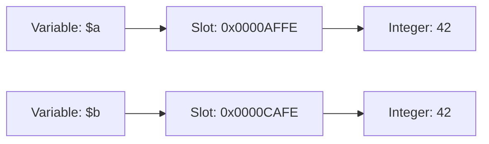
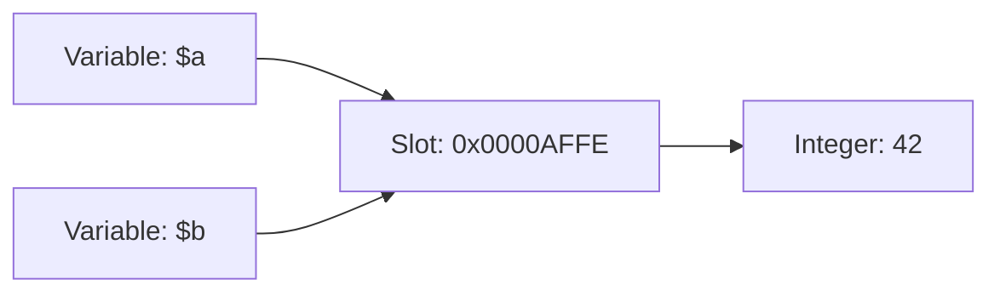

# Internal workings

## Tracking of token and AST node position
In order to throw error messages with detailed positions where the error occurred, it is necessary to store the position with each token so that it can be passed up to the AST.
For this, each `Token` has a pointer to a `Position` struct.
This is the simple part.

The complexity arises when the lexer is a look-ahead lexer, which is the case here.  
For example, the lexer function `isWhiteSpace` has the parameter whether the lexer should just check the next characters for a white space or whether it should increment the position counter.  
Another case where look-ahead is needed is when processing floats. The lexer detects that the next token starts with a number and reads the next characters until the next whitespace occurs and it can be pushed as a float token. Otherwise, e.g. if the string read is not a valid float, the lexer jumps back and tries to process it as an integer.

For this "jump back" logic, the lexer can push and pop a `PositionSnapshot` of the current position information into/from an array.
The cases that might end with a "jump back" then push a snapshot. If a jump back is required, the latest snapshot is popped and applied, otherwise the snapshot is popped and discarded.

## Memory management
The interpreter uses the structs that implement `RuntimeValue` as pointers (in GoLang).
The interpreter creates new instances for each new runtime value of type `Boolean`, `Integer`, `Floating` or `String`.
This results in "pass by value" behavior.

The above behavior results in a "pass by ref" for runtime values of type `Array`.
To solve this problem, a `DeepCopy` function is used.
It creates a deep copy for a given array runtime value.

There are two places in the interpreter logic where a DeepCopy must be created:
- array assignments: `array.SetElement(keyValue, DeepCopy(value))`
- function calls: `argument = DeepCopy(argument)`
- variable assignments: `variable = DeepCopy(value)`

PHP allows the usage of pointers for "by reference" variables for example in function parameters.
To realize this, the actual (runtime) value like an `Boolen`, `String` or `Object` is wrapped inside of a `Slot`.
A variable in the environment shows to a slot.

### Pass by value

```php
function foo($b) { }

$a = 42;
foo($a);
```



### Pass by reference

```php
function foo(&$b) { }

$a = 42;
foo($a);
```



## Performant runtime array
In the first iteration, the array implementation was very slow.  
One reason was the iteration over all keys to get the next key if no key was passed (e.g. `$a[] = 1;`).
But this was only a small part of the performance issue.  
The second reason was the way how an element was stored and looked up.
A GoLang `map[RuntimeValue]RuntimeValue` was used.
`RuntimeValue` is a pointer to one struct implementing the `RuntimeValue` interface.
The lookup of a value required the iteration of all keys to check if the given key (also a `RuntimeValue`) is equal to the one of the keys of the array.

The second iteration is now a lot faster (see [#47](https://github.com/MasterZydra/QIQ/issues/47)).  
Now a GoLang `map[string]RuntimeValue` is used.
PHP only allows integers and strings as keys.
So the map key is `i_%d` for integers and `s_%s` for strings.
This convertion from a given key to a string allows a lookup without the iteration of every key.