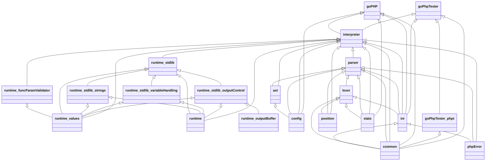

# Packages

```mermaid
classDiagram
runtime_funcParamValidator <|-- runtime_values

runtime_stdlib <|-- runtime_values
runtime_stdlib <|-- runtime

runtime_stdlib_strings <|-- runtime
runtime_stdlib_strings <|-- runtime_values
runtime_stdlib <|-- runtime_stdlib_strings

runtime_stdlib_variableHandling <|-- runtime
runtime_stdlib_variableHandling <|-- runtime_values
runtime_stdlib <|-- runtime_stdlib_variableHandling

runtime_stdlib_outputControl <|-- runtime
runtime_stdlib_outputControl <|-- runtime_outputBuffer
runtime_stdlib_outputControl <|-- runtime_values
runtime_stdlib <|-- runtime_stdlib_outputControl

ast <|-- config

ini <|-- common
ini <|-- phpError

lexer <|-- common
lexer <|-- ini
lexer <|-- position
lexer <|-- stats

parser <|-- ast
parser <|-- common
parser <|-- config
parser <|-- ini
parser <|-- lexer
parser <|-- phpError
parser <|-- position
parser <|-- stats

interpreter <|-- ini
interpreter <|-- ast
interpreter <|-- common
interpreter <|-- config
interpreter <|-- parser
interpreter <|-- phpError
interpreter <|-- position
interpreter <|-- runtime
interpreter <|-- runtime_funcParamValidator
interpreter <|-- runtime_values
interpreter <|-- runtime_stdlib
interpreter <|-- stats

goPHP <|-- common
goPHP <|-- config
goPHP <|-- ini
goPHP <|-- interpreter
goPHP <|-- stats

goPhpTester_phpt <|-- common

goPhpTester <|-- common
goPhpTester <|-- ini
goPhpTester <|-- interpreter
goPhpTester <|-- goPhpTester_phpt
```