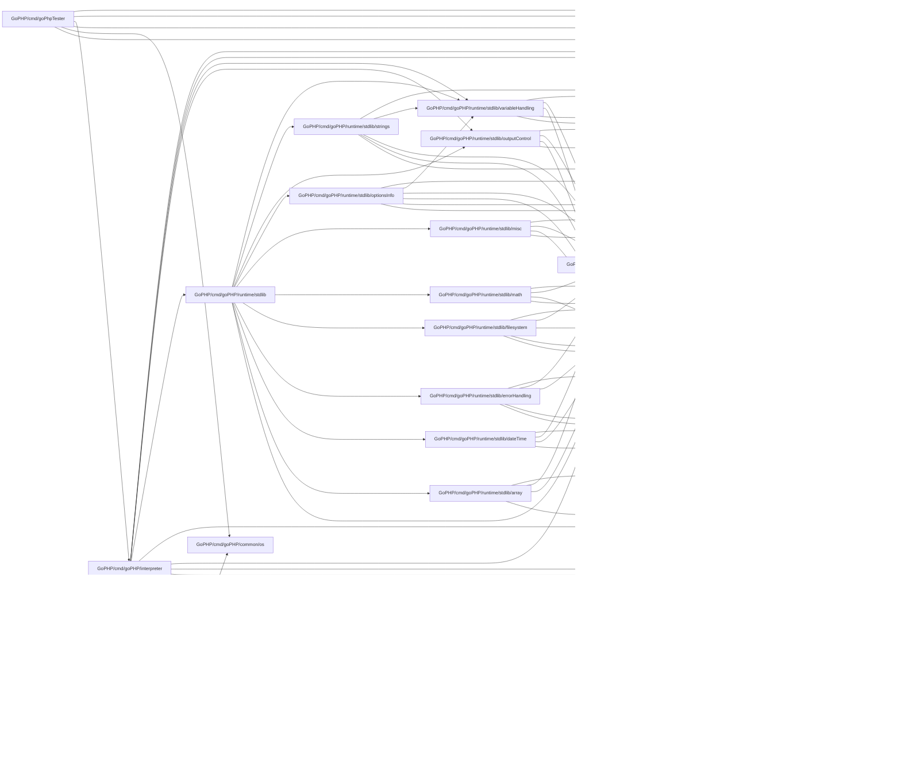

# Packages

```mermaid
flowchart LR
    GoPHP_cmd_goPHP[GoPHP/cmd/goPHP] --> GoPHP_cmd_goPHP_common[GoPHP/cmd/goPHP/common]
    GoPHP_cmd_goPHP[GoPHP/cmd/goPHP] --> GoPHP_cmd_goPHP_config[GoPHP/cmd/goPHP/config]
    GoPHP_cmd_goPHP[GoPHP/cmd/goPHP] --> GoPHP_cmd_goPHP_ini[GoPHP/cmd/goPHP/ini]
    GoPHP_cmd_goPHP[GoPHP/cmd/goPHP] --> GoPHP_cmd_goPHP_interpreter[GoPHP/cmd/goPHP/interpreter]
    GoPHP_cmd_goPHP[GoPHP/cmd/goPHP] --> GoPHP_cmd_goPHP_request[GoPHP/cmd/goPHP/request]
    GoPHP_cmd_goPHP[GoPHP/cmd/goPHP] --> GoPHP_cmd_goPHP_stats[GoPHP/cmd/goPHP/stats]

    GoPHP_cmd_goPHP_ast[GoPHP/cmd/goPHP/ast] --> GoPHP_cmd_goPHP_config[GoPHP/cmd/goPHP/config]
    GoPHP_cmd_goPHP_ast[GoPHP/cmd/goPHP/ast] --> GoPHP_cmd_goPHP_position[GoPHP/cmd/goPHP/position]

    GoPHP_cmd_goPHP_ini[GoPHP/cmd/goPHP/ini] --> GoPHP_cmd_goPHP_common[GoPHP/cmd/goPHP/common]
    GoPHP_cmd_goPHP_ini[GoPHP/cmd/goPHP/ini] --> GoPHP_cmd_goPHP_config[GoPHP/cmd/goPHP/config]
    GoPHP_cmd_goPHP_ini[GoPHP/cmd/goPHP/ini] --> GoPHP_cmd_goPHP_phpError[GoPHP/cmd/goPHP/phpError]

    GoPHP_cmd_goPHP_interpreter[GoPHP/cmd/goPHP/interpreter] --> GoPHP_cmd_goPHP_ast[GoPHP/cmd/goPHP/ast]
    GoPHP_cmd_goPHP_interpreter[GoPHP/cmd/goPHP/interpreter] --> GoPHP_cmd_goPHP_common[GoPHP/cmd/goPHP/common]
    GoPHP_cmd_goPHP_interpreter[GoPHP/cmd/goPHP/interpreter] --> GoPHP_cmd_goPHP_common_os[GoPHP/cmd/goPHP/common/os]
    GoPHP_cmd_goPHP_interpreter[GoPHP/cmd/goPHP/interpreter] --> GoPHP_cmd_goPHP_config[GoPHP/cmd/goPHP/config]
    GoPHP_cmd_goPHP_interpreter[GoPHP/cmd/goPHP/interpreter] --> GoPHP_cmd_goPHP_ini[GoPHP/cmd/goPHP/ini]
    GoPHP_cmd_goPHP_interpreter[GoPHP/cmd/goPHP/interpreter] --> GoPHP_cmd_goPHP_parser[GoPHP/cmd/goPHP/parser]
    GoPHP_cmd_goPHP_interpreter[GoPHP/cmd/goPHP/interpreter] --> GoPHP_cmd_goPHP_phpError[GoPHP/cmd/goPHP/phpError]
    GoPHP_cmd_goPHP_interpreter[GoPHP/cmd/goPHP/interpreter] --> GoPHP_cmd_goPHP_request[GoPHP/cmd/goPHP/request]
    GoPHP_cmd_goPHP_interpreter[GoPHP/cmd/goPHP/interpreter] --> GoPHP_cmd_goPHP_runtime[GoPHP/cmd/goPHP/runtime]
    GoPHP_cmd_goPHP_interpreter[GoPHP/cmd/goPHP/interpreter] --> GoPHP_cmd_goPHP_runtime_outputBuffer[GoPHP/cmd/goPHP/runtime/outputBuffer]
    GoPHP_cmd_goPHP_interpreter[GoPHP/cmd/goPHP/interpreter] --> GoPHP_cmd_goPHP_runtime_stdlib[GoPHP/cmd/goPHP/runtime/stdlib]
    GoPHP_cmd_goPHP_interpreter[GoPHP/cmd/goPHP/interpreter] --> GoPHP_cmd_goPHP_runtime_stdlib_outputControl[GoPHP/cmd/goPHP/runtime/stdlib/outputControl]
    GoPHP_cmd_goPHP_interpreter[GoPHP/cmd/goPHP/interpreter] --> GoPHP_cmd_goPHP_runtime_stdlib_variableHandling[GoPHP/cmd/goPHP/runtime/stdlib/variableHandling]
    GoPHP_cmd_goPHP_interpreter[GoPHP/cmd/goPHP/interpreter] --> GoPHP_cmd_goPHP_runtime_values[GoPHP/cmd/goPHP/runtime/values]
    GoPHP_cmd_goPHP_interpreter[GoPHP/cmd/goPHP/interpreter] --> GoPHP_cmd_goPHP_stats[GoPHP/cmd/goPHP/stats]

    GoPHP_cmd_goPHP_lexer[GoPHP/cmd/goPHP/lexer] --> GoPHP_cmd_goPHP_common[GoPHP/cmd/goPHP/common]
    GoPHP_cmd_goPHP_lexer[GoPHP/cmd/goPHP/lexer] --> GoPHP_cmd_goPHP_ini[GoPHP/cmd/goPHP/ini]
    GoPHP_cmd_goPHP_lexer[GoPHP/cmd/goPHP/lexer] --> GoPHP_cmd_goPHP_position[GoPHP/cmd/goPHP/position]
    GoPHP_cmd_goPHP_lexer[GoPHP/cmd/goPHP/lexer] --> GoPHP_cmd_goPHP_stats[GoPHP/cmd/goPHP/stats]

    GoPHP_cmd_goPHP_parser[GoPHP/cmd/goPHP/parser] --> GoPHP_cmd_goPHP_ast[GoPHP/cmd/goPHP/ast]
    GoPHP_cmd_goPHP_parser[GoPHP/cmd/goPHP/parser] --> GoPHP_cmd_goPHP_common[GoPHP/cmd/goPHP/common]
    GoPHP_cmd_goPHP_parser[GoPHP/cmd/goPHP/parser] --> GoPHP_cmd_goPHP_config[GoPHP/cmd/goPHP/config]
    GoPHP_cmd_goPHP_parser[GoPHP/cmd/goPHP/parser] --> GoPHP_cmd_goPHP_ini[GoPHP/cmd/goPHP/ini]
    GoPHP_cmd_goPHP_parser[GoPHP/cmd/goPHP/parser] --> GoPHP_cmd_goPHP_lexer[GoPHP/cmd/goPHP/lexer]
    GoPHP_cmd_goPHP_parser[GoPHP/cmd/goPHP/parser] --> GoPHP_cmd_goPHP_phpError[GoPHP/cmd/goPHP/phpError]
    GoPHP_cmd_goPHP_parser[GoPHP/cmd/goPHP/parser] --> GoPHP_cmd_goPHP_position[GoPHP/cmd/goPHP/position]
    GoPHP_cmd_goPHP_parser[GoPHP/cmd/goPHP/parser] --> GoPHP_cmd_goPHP_stats[GoPHP/cmd/goPHP/stats]

    GoPHP_cmd_goPHP_runtime[GoPHP/cmd/goPHP/runtime] --> GoPHP_cmd_goPHP_ini[GoPHP/cmd/goPHP/ini]
    GoPHP_cmd_goPHP_runtime[GoPHP/cmd/goPHP/runtime] --> GoPHP_cmd_goPHP_phpError[GoPHP/cmd/goPHP/phpError]
    GoPHP_cmd_goPHP_runtime[GoPHP/cmd/goPHP/runtime] --> GoPHP_cmd_goPHP_request[GoPHP/cmd/goPHP/request]
    GoPHP_cmd_goPHP_runtime[GoPHP/cmd/goPHP/runtime] --> GoPHP_cmd_goPHP_runtime_outputBuffer[GoPHP/cmd/goPHP/runtime/outputBuffer]
    GoPHP_cmd_goPHP_runtime[GoPHP/cmd/goPHP/runtime] --> GoPHP_cmd_goPHP_runtime_values[GoPHP/cmd/goPHP/runtime/values]

    GoPHP_cmd_goPHP_runtime_funcParamValidator[GoPHP/cmd/goPHP/runtime/funcParamValidator] --> GoPHP_cmd_goPHP_phpError[GoPHP/cmd/goPHP/phpError]
    GoPHP_cmd_goPHP_runtime_funcParamValidator[GoPHP/cmd/goPHP/runtime/funcParamValidator] --> GoPHP_cmd_goPHP_runtime_values[GoPHP/cmd/goPHP/runtime/values]

    GoPHP_cmd_goPHP_runtime_stdlib[GoPHP/cmd/goPHP/runtime/stdlib] --> GoPHP_cmd_goPHP_runtime[GoPHP/cmd/goPHP/runtime]
    GoPHP_cmd_goPHP_runtime_stdlib[GoPHP/cmd/goPHP/runtime/stdlib] --> GoPHP_cmd_goPHP_runtime_stdlib_array[GoPHP/cmd/goPHP/runtime/stdlib/array]
    GoPHP_cmd_goPHP_runtime_stdlib[GoPHP/cmd/goPHP/runtime/stdlib] --> GoPHP_cmd_goPHP_runtime_stdlib_dateTime[GoPHP/cmd/goPHP/runtime/stdlib/dateTime]
    GoPHP_cmd_goPHP_runtime_stdlib[GoPHP/cmd/goPHP/runtime/stdlib] --> GoPHP_cmd_goPHP_runtime_stdlib_errorHandling[GoPHP/cmd/goPHP/runtime/stdlib/errorHandling]
    GoPHP_cmd_goPHP_runtime_stdlib[GoPHP/cmd/goPHP/runtime/stdlib] --> GoPHP_cmd_goPHP_runtime_stdlib_filesystem[GoPHP/cmd/goPHP/runtime/stdlib/filesystem]
    GoPHP_cmd_goPHP_runtime_stdlib[GoPHP/cmd/goPHP/runtime/stdlib] --> GoPHP_cmd_goPHP_runtime_stdlib_math[GoPHP/cmd/goPHP/runtime/stdlib/math]
    GoPHP_cmd_goPHP_runtime_stdlib[GoPHP/cmd/goPHP/runtime/stdlib] --> GoPHP_cmd_goPHP_runtime_stdlib_misc[GoPHP/cmd/goPHP/runtime/stdlib/misc]
    GoPHP_cmd_goPHP_runtime_stdlib[GoPHP/cmd/goPHP/runtime/stdlib] --> GoPHP_cmd_goPHP_runtime_stdlib_optionsInfo[GoPHP/cmd/goPHP/runtime/stdlib/optionsInfo]
    GoPHP_cmd_goPHP_runtime_stdlib[GoPHP/cmd/goPHP/runtime/stdlib] --> GoPHP_cmd_goPHP_runtime_stdlib_outputControl[GoPHP/cmd/goPHP/runtime/stdlib/outputControl]
    GoPHP_cmd_goPHP_runtime_stdlib[GoPHP/cmd/goPHP/runtime/stdlib] --> GoPHP_cmd_goPHP_runtime_stdlib_strings[GoPHP/cmd/goPHP/runtime/stdlib/strings]
    GoPHP_cmd_goPHP_runtime_stdlib[GoPHP/cmd/goPHP/runtime/stdlib] --> GoPHP_cmd_goPHP_runtime_stdlib_variableHandling[GoPHP/cmd/goPHP/runtime/stdlib/variableHandling]

    GoPHP_cmd_goPHP_runtime_stdlib_array[GoPHP/cmd/goPHP/runtime/stdlib/array] --> GoPHP_cmd_goPHP_phpError[GoPHP/cmd/goPHP/phpError]
    GoPHP_cmd_goPHP_runtime_stdlib_array[GoPHP/cmd/goPHP/runtime/stdlib/array] --> GoPHP_cmd_goPHP_runtime[GoPHP/cmd/goPHP/runtime]
    GoPHP_cmd_goPHP_runtime_stdlib_array[GoPHP/cmd/goPHP/runtime/stdlib/array] --> GoPHP_cmd_goPHP_runtime_funcParamValidator[GoPHP/cmd/goPHP/runtime/funcParamValidator]
    GoPHP_cmd_goPHP_runtime_stdlib_array[GoPHP/cmd/goPHP/runtime/stdlib/array] --> GoPHP_cmd_goPHP_runtime_values[GoPHP/cmd/goPHP/runtime/values]

    GoPHP_cmd_goPHP_runtime_stdlib_dateTime[GoPHP/cmd/goPHP/runtime/stdlib/dateTime] --> GoPHP_cmd_goPHP_phpError[GoPHP/cmd/goPHP/phpError]
    GoPHP_cmd_goPHP_runtime_stdlib_dateTime[GoPHP/cmd/goPHP/runtime/stdlib/dateTime] --> GoPHP_cmd_goPHP_runtime[GoPHP/cmd/goPHP/runtime]
    GoPHP_cmd_goPHP_runtime_stdlib_dateTime[GoPHP/cmd/goPHP/runtime/stdlib/dateTime] --> GoPHP_cmd_goPHP_runtime_funcParamValidator[GoPHP/cmd/goPHP/runtime/funcParamValidator]
    GoPHP_cmd_goPHP_runtime_stdlib_dateTime[GoPHP/cmd/goPHP/runtime/stdlib/dateTime] --> GoPHP_cmd_goPHP_runtime_values[GoPHP/cmd/goPHP/runtime/values]

    GoPHP_cmd_goPHP_runtime_stdlib_errorHandling[GoPHP/cmd/goPHP/runtime/stdlib/errorHandling] --> GoPHP_cmd_goPHP_ini[GoPHP/cmd/goPHP/ini]
    GoPHP_cmd_goPHP_runtime_stdlib_errorHandling[GoPHP/cmd/goPHP/runtime/stdlib/errorHandling] --> GoPHP_cmd_goPHP_phpError[GoPHP/cmd/goPHP/phpError]
    GoPHP_cmd_goPHP_runtime_stdlib_errorHandling[GoPHP/cmd/goPHP/runtime/stdlib/errorHandling] --> GoPHP_cmd_goPHP_runtime[GoPHP/cmd/goPHP/runtime]
    GoPHP_cmd_goPHP_runtime_stdlib_errorHandling[GoPHP/cmd/goPHP/runtime/stdlib/errorHandling] --> GoPHP_cmd_goPHP_runtime_funcParamValidator[GoPHP/cmd/goPHP/runtime/funcParamValidator]
    GoPHP_cmd_goPHP_runtime_stdlib_errorHandling[GoPHP/cmd/goPHP/runtime/stdlib/errorHandling] --> GoPHP_cmd_goPHP_runtime_values[GoPHP/cmd/goPHP/runtime/values]

    GoPHP_cmd_goPHP_runtime_stdlib_filesystem[GoPHP/cmd/goPHP/runtime/stdlib/filesystem] --> GoPHP_cmd_goPHP_common[GoPHP/cmd/goPHP/common]
    GoPHP_cmd_goPHP_runtime_stdlib_filesystem[GoPHP/cmd/goPHP/runtime/stdlib/filesystem] --> GoPHP_cmd_goPHP_phpError[GoPHP/cmd/goPHP/phpError]
    GoPHP_cmd_goPHP_runtime_stdlib_filesystem[GoPHP/cmd/goPHP/runtime/stdlib/filesystem] --> GoPHP_cmd_goPHP_runtime[GoPHP/cmd/goPHP/runtime]
    GoPHP_cmd_goPHP_runtime_stdlib_filesystem[GoPHP/cmd/goPHP/runtime/stdlib/filesystem] --> GoPHP_cmd_goPHP_runtime_funcParamValidator[GoPHP/cmd/goPHP/runtime/funcParamValidator]
    GoPHP_cmd_goPHP_runtime_stdlib_filesystem[GoPHP/cmd/goPHP/runtime/stdlib/filesystem] --> GoPHP_cmd_goPHP_runtime_values[GoPHP/cmd/goPHP/runtime/values]

    GoPHP_cmd_goPHP_runtime_stdlib_math[GoPHP/cmd/goPHP/runtime/stdlib/math] --> GoPHP_cmd_goPHP_phpError[GoPHP/cmd/goPHP/phpError]
    GoPHP_cmd_goPHP_runtime_stdlib_math[GoPHP/cmd/goPHP/runtime/stdlib/math] --> GoPHP_cmd_goPHP_runtime[GoPHP/cmd/goPHP/runtime]
    GoPHP_cmd_goPHP_runtime_stdlib_math[GoPHP/cmd/goPHP/runtime/stdlib/math] --> GoPHP_cmd_goPHP_runtime_funcParamValidator[GoPHP/cmd/goPHP/runtime/funcParamValidator]
    GoPHP_cmd_goPHP_runtime_stdlib_math[GoPHP/cmd/goPHP/runtime/stdlib/math] --> GoPHP_cmd_goPHP_runtime_values[GoPHP/cmd/goPHP/runtime/values]

    GoPHP_cmd_goPHP_runtime_stdlib_misc[GoPHP/cmd/goPHP/runtime/stdlib/misc] --> GoPHP_cmd_goPHP_phpError[GoPHP/cmd/goPHP/phpError]
    GoPHP_cmd_goPHP_runtime_stdlib_misc[GoPHP/cmd/goPHP/runtime/stdlib/misc] --> GoPHP_cmd_goPHP_runtime[GoPHP/cmd/goPHP/runtime]
    GoPHP_cmd_goPHP_runtime_stdlib_misc[GoPHP/cmd/goPHP/runtime/stdlib/misc] --> GoPHP_cmd_goPHP_runtime_funcParamValidator[GoPHP/cmd/goPHP/runtime/funcParamValidator]
    GoPHP_cmd_goPHP_runtime_stdlib_misc[GoPHP/cmd/goPHP/runtime/stdlib/misc] --> GoPHP_cmd_goPHP_runtime_values[GoPHP/cmd/goPHP/runtime/values]

    GoPHP_cmd_goPHP_runtime_stdlib_optionsInfo[GoPHP/cmd/goPHP/runtime/stdlib/optionsInfo] --> GoPHP_cmd_goPHP_ini[GoPHP/cmd/goPHP/ini]
    GoPHP_cmd_goPHP_runtime_stdlib_optionsInfo[GoPHP/cmd/goPHP/runtime/stdlib/optionsInfo] --> GoPHP_cmd_goPHP_phpError[GoPHP/cmd/goPHP/phpError]
    GoPHP_cmd_goPHP_runtime_stdlib_optionsInfo[GoPHP/cmd/goPHP/runtime/stdlib/optionsInfo] --> GoPHP_cmd_goPHP_runtime[GoPHP/cmd/goPHP/runtime]
    GoPHP_cmd_goPHP_runtime_stdlib_optionsInfo[GoPHP/cmd/goPHP/runtime/stdlib/optionsInfo] --> GoPHP_cmd_goPHP_runtime_funcParamValidator[GoPHP/cmd/goPHP/runtime/funcParamValidator]
    GoPHP_cmd_goPHP_runtime_stdlib_optionsInfo[GoPHP/cmd/goPHP/runtime/stdlib/optionsInfo] --> GoPHP_cmd_goPHP_runtime_stdlib_variableHandling[GoPHP/cmd/goPHP/runtime/stdlib/variableHandling]
    GoPHP_cmd_goPHP_runtime_stdlib_optionsInfo[GoPHP/cmd/goPHP/runtime/stdlib/optionsInfo] --> GoPHP_cmd_goPHP_runtime_values[GoPHP/cmd/goPHP/runtime/values]

    GoPHP_cmd_goPHP_runtime_stdlib_outputControl[GoPHP/cmd/goPHP/runtime/stdlib/outputControl] --> GoPHP_cmd_goPHP_phpError[GoPHP/cmd/goPHP/phpError]
    GoPHP_cmd_goPHP_runtime_stdlib_outputControl[GoPHP/cmd/goPHP/runtime/stdlib/outputControl] --> GoPHP_cmd_goPHP_runtime[GoPHP/cmd/goPHP/runtime]
    GoPHP_cmd_goPHP_runtime_stdlib_outputControl[GoPHP/cmd/goPHP/runtime/stdlib/outputControl] --> GoPHP_cmd_goPHP_runtime_funcParamValidator[GoPHP/cmd/goPHP/runtime/funcParamValidator]
    GoPHP_cmd_goPHP_runtime_stdlib_outputControl[GoPHP/cmd/goPHP/runtime/stdlib/outputControl] --> GoPHP_cmd_goPHP_runtime_values[GoPHP/cmd/goPHP/runtime/values]

    GoPHP_cmd_goPHP_runtime_stdlib_strings[GoPHP/cmd/goPHP/runtime/stdlib/strings] --> GoPHP_cmd_goPHP_phpError[GoPHP/cmd/goPHP/phpError]
    GoPHP_cmd_goPHP_runtime_stdlib_strings[GoPHP/cmd/goPHP/runtime/stdlib/strings] --> GoPHP_cmd_goPHP_runtime[GoPHP/cmd/goPHP/runtime]
    GoPHP_cmd_goPHP_runtime_stdlib_strings[GoPHP/cmd/goPHP/runtime/stdlib/strings] --> GoPHP_cmd_goPHP_runtime_funcParamValidator[GoPHP/cmd/goPHP/runtime/funcParamValidator]
    GoPHP_cmd_goPHP_runtime_stdlib_strings[GoPHP/cmd/goPHP/runtime/stdlib/strings] --> GoPHP_cmd_goPHP_runtime_stdlib_variableHandling[GoPHP/cmd/goPHP/runtime/stdlib/variableHandling]
    GoPHP_cmd_goPHP_runtime_stdlib_strings[GoPHP/cmd/goPHP/runtime/stdlib/strings] --> GoPHP_cmd_goPHP_runtime_values[GoPHP/cmd/goPHP/runtime/values]

    GoPHP_cmd_goPHP_runtime_stdlib_variableHandling[GoPHP/cmd/goPHP/runtime/stdlib/variableHandling] --> GoPHP_cmd_goPHP_common[GoPHP/cmd/goPHP/common]
    GoPHP_cmd_goPHP_runtime_stdlib_variableHandling[GoPHP/cmd/goPHP/runtime/stdlib/variableHandling] --> GoPHP_cmd_goPHP_phpError[GoPHP/cmd/goPHP/phpError]
    GoPHP_cmd_goPHP_runtime_stdlib_variableHandling[GoPHP/cmd/goPHP/runtime/stdlib/variableHandling] --> GoPHP_cmd_goPHP_runtime[GoPHP/cmd/goPHP/runtime]
    GoPHP_cmd_goPHP_runtime_stdlib_variableHandling[GoPHP/cmd/goPHP/runtime/stdlib/variableHandling] --> GoPHP_cmd_goPHP_runtime_funcParamValidator[GoPHP/cmd/goPHP/runtime/funcParamValidator]
    GoPHP_cmd_goPHP_runtime_stdlib_variableHandling[GoPHP/cmd/goPHP/runtime/stdlib/variableHandling] --> GoPHP_cmd_goPHP_runtime_values[GoPHP/cmd/goPHP/runtime/values]

    GoPHP_cmd_goPHP_runtime_values[GoPHP/cmd/goPHP/runtime/values] --> GoPHP_cmd_goPHP_common[GoPHP/cmd/goPHP/common]
    GoPHP_cmd_goPHP_runtime_values[GoPHP/cmd/goPHP/runtime/values] --> GoPHP_cmd_goPHP_config[GoPHP/cmd/goPHP/config]
    GoPHP_cmd_goPHP_runtime_values[GoPHP/cmd/goPHP/runtime/values] --> GoPHP_cmd_goPHP_phpError[GoPHP/cmd/goPHP/phpError]

    GoPHP_cmd_goPHP_stats[GoPHP/cmd/goPHP/stats] --> GoPHP_cmd_goPHP_config[GoPHP/cmd/goPHP/config]

    GoPHP_cmd_goPhpTester[GoPHP/cmd/goPhpTester] --> GoPHP_cmd_goPHP_common[GoPHP/cmd/goPHP/common]
    GoPHP_cmd_goPhpTester[GoPHP/cmd/goPhpTester] --> GoPHP_cmd_goPHP_common_os[GoPHP/cmd/goPHP/common/os]
    GoPHP_cmd_goPhpTester[GoPHP/cmd/goPhpTester] --> GoPHP_cmd_goPHP_ini[GoPHP/cmd/goPHP/ini]
    GoPHP_cmd_goPhpTester[GoPHP/cmd/goPhpTester] --> GoPHP_cmd_goPHP_interpreter[GoPHP/cmd/goPHP/interpreter]
    GoPHP_cmd_goPhpTester[GoPHP/cmd/goPhpTester] --> GoPHP_cmd_goPHP_request[GoPHP/cmd/goPHP/request]
    GoPHP_cmd_goPhpTester[GoPHP/cmd/goPhpTester] --> GoPHP_cmd_goPhpTester_phpt[GoPHP/cmd/goPhpTester/phpt]

    GoPHP_cmd_goPhpTester_phpt[GoPHP/cmd/goPhpTester/phpt] --> GoPHP_cmd_goPHP_common[GoPHP/cmd/goPHP/common]

```